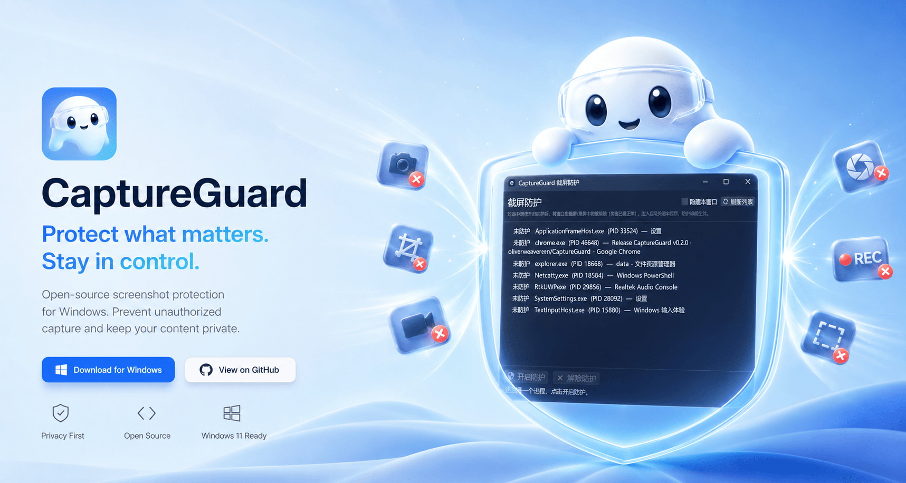

# CaptureGuard

<p align="center">
  
</p>

[](https://github.com/oliverweaverenr/CaptureGuard/actions/workflows/ci.yml)
[](https://github.com/oliverweaverenr/CaptureGuard/releases)
[](LICENSE)

[简体中文](README.zh-CN.md)

CaptureGuard is a Windows capture-protection utility. It marks selected
application windows as excluded from system screen capture: the user can still
see the window normally, while common screenshot, recording, and screen-capture
pipelines do not receive the protected window content.

The app provides a lightweight GUI: pick a process, enable protection, close the
GUI if desired, and reopen it later to inspect state or disable protection.

> Use CaptureGuard only on devices and processes you own or are authorized to
> operate. Do not use it to bypass workplace compliance, exam monitoring, DRM,
> copyright protection, or any third-party terms or legal restrictions.


## Overview




## Features

- Visual process picker for applications with visible windows.
- Uses the native Windows display-affinity API for capture exclusion.
- Keeps protection alive inside the target process after the GUI is closed.
- Detects already protected processes when the GUI is reopened.
- Can disable protection and unload the injected DLL from the target process.
- Recursively applies protection to top-level windows and child windows.
- Optional self-protection for the CaptureGuard window itself.
- Ships as a single `capture-guard.exe` release artifact.
- Automatically adapts the GUI language to the system locale.


## How It Works

CaptureGuard relies on the Windows API:

```text
SetWindowDisplayAffinity(hwnd, WDA_EXCLUDEFROMCAPTURE)
```

The setting is enforced by DWM at the composition layer, allowing a window to be
excluded from supported screen-capture paths.

Windows requires this API to be called by the process that owns the target
window. CaptureGuard therefore injects a small DLL into the selected process and
sets the display affinity from inside that process.

To disable protection, the GUI signals a local named event created by the DLL.
The DLL restores the windows to normal capture behavior and unloads itself.

See [Architecture](docs/architecture.md) for implementation details.


## Project Layout

```text
.
├── gui/                    # eframe GUI, process listing, injection, status checks
├── protect-dll/            # injected DLL that applies window capture exclusion
├── docs/                   # architecture and release documentation
├── .github/workflows/      # CI and release automation
├── Cargo.toml              # Rust workspace configuration
├── Cargo.lock              # locked dependencies for the application
├── CONTRIBUTING.md         # contribution guide
├── SECURITY.md             # security policy and responsible-use scope
└── LICENSE                 # MIT license
```


## Download

Download the latest `capture-guard-*-x86_64-windows.exe` from
[Releases](../../releases).

Requirements:

- Windows 10 version 2004 or later is recommended.
- 64-bit Windows.
- 64-bit target process.

Usage:

1. Run `capture-guard.exe`.
2. Select the process you want to protect.
3. Click `Protect`.
4. You can close CaptureGuard after protection is enabled.
5. Reopen CaptureGuard, select the same process, and click `Unprotect` to
   restore normal capture behavior.

Language selection follows the Windows UI language. For testing, set
`CAPTUREGUARD_LANG=en` or `CAPTUREGUARD_LANG=zh-CN` before launching the app.


## Build From Source

CaptureGuard is Windows-only and must be built with the x64 MSVC toolchain.

Recommended environment:

- Windows 10/11 x64
- Rust stable
- `x86_64-pc-windows-msvc` target
- Visual Studio Build Tools or Visual Studio with MSVC

Build:

```powershell
cargo build --release --bin capture-guard
```

Output:

```text
target/release/capture-guard.exe
```

During the build, `gui/build.rs` compiles `protect-dll` and embeds the produced
DLL bytes into the GUI executable. At runtime, CaptureGuard extracts the DLL to
the user temp directory and injects it through `LoadLibraryW`.


## Development Checks

Before submitting changes, run:

```powershell
cargo fmt --all -- --check
cargo clippy --all-targets -- -D warnings
cargo build --release --bin capture-guard
```

GitHub Actions are configured for:

- `CI`: format check, Clippy, and release build on push and pull request.
- `Release`: builds a Windows single-file artifact and publishes a GitHub
  Release when a `v*` tag is pushed.

See [Release Process](docs/release.md) for release steps.


## Limitations

- Bitness must match. The current release targets 64-bit Windows and 64-bit
  target processes.
- Administrator privileges may be required when injecting into a process running
  at a higher integrity level.
- Security software may block DLL injection or remote thread creation.
- CaptureGuard only protects windows owned by the selected process. Some apps
  host visible windows in another process, such as UWP
  `ApplicationFrameHost.exe` or multi-process browsers.
- On systems older than Windows 10 version 2004, `WDA_EXCLUDEFROMCAPTURE` is not
  available. CaptureGuard falls back to `WDA_MONITOR`, which typically shows a
  black rectangle instead of fully excluding the window.


## Community Support

- Community discussion and support: [Linux.do](https://linux.do/).


## AI Collaboration

This project was completed with assistance from Codex GPT5.5 and Claude Code
Opus 4.8.


## Contributing

Issues and pull requests are welcome. Please read
[CONTRIBUTING.md](CONTRIBUTING.md) before contributing.

CaptureGuard involves DLL injection and capture protection. To keep the project
scope clear, the project will not accept changes that:

- Bypass security software, EDR, DRM, exam monitoring, or workplace monitoring.
- Add stealth persistence, privilege escalation, anti-forensics, or audit
  evasion.
- Provide abuse-oriented tutorials, bypass guidance, or default configurations.


## License

This project is licensed under the [MIT License](LICENSE).


## Disclaimer

CaptureGuard is provided for learning, research, and privacy protection on
owned or authorized devices. Users are responsible for ensuring their use is
legal and compliant. The authors and contributors are not responsible for misuse
or resulting consequences.
