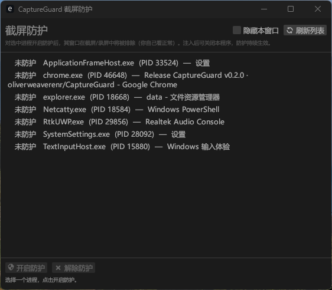

# CaptureGuard

[](https://github.com/oliverweaverenr/CaptureGuard/actions/workflows/ci.yml)
[](https://github.com/oliverweaverenr/CaptureGuard/releases)
[](LICENSE)

[English](README.md)

CaptureGuard 是一个 Windows 截屏防护工具。它可以把指定进程的窗口设置为
系统级截屏排除：用户仍能正常看见窗口，但常见截图、录屏和屏幕采集工具不会捕获
该窗口内容。

项目提供一个轻量 GUI：选择目标进程，开启防护，关闭 GUI 后防护仍会持续；再次打开
GUI 可以查看状态并解除防护。

> 本项目仅用于你自己拥有或已获授权的设备。请勿用于规避企业合规、监考、版权保护、
> 数字版权管理或任何违反法律法规及第三方服务条款的场景。


## 界面截图




## 功能特性

- 可视化选择拥有可见窗口的进程。
- 对目标窗口调用 Windows 原生截屏排除能力。
- 防护逻辑在目标进程内独立运行，GUI 关闭后仍持续生效。
- 支持重新打开 GUI 后识别已防护进程，并主动解除防护。
- 递归处理目标进程的顶层窗口与子窗口，覆盖常见弹窗、下拉框和渲染子窗口。
- 可选择让 CaptureGuard 自身窗口也从截屏中隐藏。
- Release 产物为单文件 `capture-guard.exe`，无需额外分发 DLL。
- 程序会根据系统语言自动切换界面语言。


## 工作原理

核心 API 是 Windows 的 `SetWindowDisplayAffinity(hwnd, WDA_EXCLUDEFROMCAPTURE)`。
该能力由 DWM 在合成层执行，用于让窗口内容从系统截图和录屏链路中排除。

这个 API 只能由窗口所属进程调用。因此 CaptureGuard 会把一个小型 DLL 注入目标进程，
由 DLL 在目标进程内部完成窗口属性设置。

解除防护时，GUI 会触发目标进程内 DLL 创建的本地命名事件。DLL 收到事件后会把窗口
恢复为可截屏状态，并自行卸载。

更完整的实现说明见 [架构文档](docs/architecture.md)。


## 项目结构

```text
.
├── gui/                    # eframe GUI、进程枚举、注入、状态检测
├── protect-dll/            # 注入目标进程的窗口防护 DLL
├── docs/                   # 架构、发布和维护文档
├── .github/workflows/      # CI 与 Release 自动化
├── Cargo.toml              # Rust workspace 配置
├── Cargo.lock              # 应用项目锁定依赖版本
├── CONTRIBUTING.md         # 贡献指南
├── SECURITY.md             # 安全策略与负责任使用边界
└── LICENSE                 # MIT 许可证
```


## 下载使用

到 [Releases](../../releases) 下载最新的
`capture-guard-*-x86_64-windows.exe`。

运行要求：

- Windows 10 2004 或更高版本优先。
- 64 位 Windows。
- 目标进程也需要是 64 位进程。

使用步骤：

1. 双击运行 `capture-guard.exe`。
2. 在列表中选择需要防护的进程。
3. 点击“开启防护”。
4. 防护开启后可以关闭 CaptureGuard，目标窗口仍会持续防护。
5. 需要恢复时重新打开 CaptureGuard，选择同一进程并点击“解除防护”。

界面语言默认跟随 Windows UI 语言。测试时可在启动前设置
`CAPTUREGUARD_LANG=en` 或 `CAPTUREGUARD_LANG=zh-CN` 强制指定。


## 本地构建

本项目是 Windows-only 工具，需要在 Windows 上使用 x64 MSVC 工具链构建。

推荐环境：

- Windows 10/11 x64
- Rust stable
- `x86_64-pc-windows-msvc` target
- Visual Studio Build Tools 或 Visual Studio 的 MSVC 工具链

构建命令：

```powershell
cargo build --release --bin capture-guard
```

产物位置：

```text
target/release/capture-guard.exe
```

构建时 `gui/build.rs` 会先编译 `protect-dll`，再把 DLL 字节嵌入 GUI 可执行文件。
运行时会把 DLL 释放到用户临时目录，再通过 `LoadLibraryW` 注入目标进程。


## 开发验证

提交前建议运行：

```powershell
cargo fmt --all -- --check
cargo clippy --all-targets -- -D warnings
cargo build --release --bin capture-guard
```

仓库已配置 GitHub Actions：

- `CI`：push / pull request 时运行格式检查、Clippy 和 release 构建。
- `Release`：推送 `v*` tag 时构建 Windows 单文件产物并发布到 GitHub Release。

发布流程见 [发布文档](docs/release.md)。


## 常见限制

- 只能防护同位数进程。当前 Release 面向 64 位 Windows 和 64 位目标进程。
- 注入更高完整性级别的进程时，可能需要以管理员身份运行。
- 安全软件可能拦截 DLL 注入或远程线程创建。
- 只会处理目标进程拥有的窗口。如果实际窗口属于其他进程，例如 UWP
  `ApplicationFrameHost.exe` 或多进程浏览器，需要选择真正持有窗口的进程。
- Windows 10 2004 之前的系统不支持 `WDA_EXCLUDEFROMCAPTURE`，会退化为
  `WDA_MONITOR`，截图中通常表现为黑块而不是完全消失。


## 贡献

欢迎提交 issue 和 pull request。参与前请先阅读 [贡献指南](CONTRIBUTING.md)。

这个项目涉及 DLL 注入与窗口采集防护。为了保持边界清晰，项目不会接受以下类型的改动：

- 绕过安全软件、EDR、DRM、监考系统或企业监控的功能。
- 隐蔽持久化、提权、反取证或规避审计的能力。
- 针对第三方产品的滥用教程、绕过说明或默认配置。


## 许可证

本项目以 [MIT 许可证](LICENSE) 开源。


## 免责声明

CaptureGuard 仅供学习研究以及在自有或获授权设备上进行隐私保护使用。使用者应自行确认
使用场景是否合法合规。作者和贡献者不对任何滥用行为或由此产生的后果负责。
